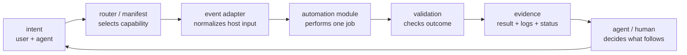

# modular automation pattern

<overview>

modular automation is the harness layer that turns recurring agent mechanics
into small, composable, directly executable units.

the model still supplies judgment: understanding intent, choosing an approach,
handling ambiguity, and explaining trade-offs. automation owns the parts that
should behave the same every time: parsing inputs, routing events, enforcing
guards, invoking tools, validating results, and recording evidence.

the goal is not to replace prompts with code. it is to stop asking prompts to
simulate a runtime.

</overview>

## the role it fills

without an automation layer, a harness tends to repeat operational rules in
prompts and hope the model remembers to follow them. that produces behavior
which is difficult to test, reuse, or observe.

modular automation provides the deterministic substrate underneath the runtime
planes described in [what is a harness?](../what-is-a-harness.md):

- request assembly can load context through explicit routers and resolvers;
- lifecycle events can dispatch through narrow hook adapters;
- tools can expose typed, discoverable contracts;
- permission and safety rules can run before a side effect;
- validation can run after an action and emit reviewable evidence;
- sync and bootstrap can project one manifest into host-specific configuration.

this is a control flow, not a required implementation stack. a simple CLI may
combine the router, adapter, and module in one process while preserving their
separate responsibilities.

## division of responsibility

| surface | owns | should not own |
| --- | --- | --- |
| router document | what to read or invoke for a given concern | detailed workflow logic |
| prompt or skill | judgment, heuristics, escalation, and interpretation | deterministic parsing or safety enforcement |
| manifest or registry | which modules exist and how they compose | module internals |
| hook adapter | lifecycle timing and host protocol translation | the policy or operation itself |
| automation module | one bounded operation with an explicit contract | unrelated orchestration or hidden context |
| validator | observable acceptance criteria | rewriting the result it is checking |
| evidence surface | what ran, what happened, and what remains uncertain | deciding success without a check |

the key boundary is simple: if a rule must happen every time and can be checked
mechanically, it belongs in automation. if it depends on meaning, incomplete
information, or trade-offs, it remains with the agent.

## module contract

an automation unit is useful to the harness only when it can stand on its own.
it should have:

1. a direct invocation surface such as a CLI command, script, or function;
2. explicit inputs, preferably schema-backed when the shape is non-trivial;
3. explicit output and exit semantics for success, no-op, blocked, and failure;
4. bounded side effects and a named ownership area;
5. declared runtime dependencies and no reliance on hidden prompt context;
6. a way to exercise the module without starting a full agent session;
7. one source of truth for its policy, with adapters delegating to it;
8. validation or evidence proportional to the action it performs.

standalone does not mean dependency-free. it means the dependency boundary is
visible and the unit can be invoked and tested without reconstructing the
entire harness.

## composition rules

### keep hooks thin

a hook should translate a host event into the module's input and translate the
result back into the host protocol. the hook must not become a second home for
rewrite rules, permissions, or validation logic.

### prefer declarations over duplicate glue

tool and agent interfaces should be declared once, then used to generate help,
validation, schemas, wrappers, or function declarations. generated projections
are replaceable outputs, not new sources of truth.

### route progressively

entrypoint documents should point to deeper context instead of embedding all of
it. routing controls context cost and ownership; it does not execute business
logic.

### put guards before effects and checkpoints after them

preflight modules block invalid or dangerous actions before mutation. outcome
checks run after automation and report what was actually observed. neither
should depend on the agent remembering a paragraph in a prompt.

### compose through contracts

modules should exchange stable inputs, outputs, exit codes, and artifacts. do
not compose them by scraping prose from another module's logs or by assuming a
particular model response.

## reusable source patterns

the examined source material contains both portable automation and
project-specific agent material. the harness should preserve the patterns below
without copying the whole environment.

| source pattern | reusable idea | treatment in the harness |
| --- | --- | --- |
| layered entrypoint and topic routers | a small entrypoint can govern progressive context loading | adopt as a routing pattern, not as prompt content |
| declarative CLI sources, generated declarations, and executable wrappers | declare an interface once and generate host-facing projections | adopt the declaration/source/projection split |
| a thin command-rewrite hook backed by a standalone command | a hook can stay thin while a standalone command owns rewrite and policy logic | adopt thin adapter plus single-source module ownership |
| a shared destructive-operation guard | deterministic safety rules belong in reusable guard modules | adopt the guard-library pattern at destructive boundaries |
| an event-driven context selector with a stdin/stdout contract | lifecycle events can select context dynamically through explicit protocols | keep the event-adapter concept; only adopt the implementation after its workspace and state dependencies are explicit |
| routed lessons and knowledge references | deep knowledge can remain available without loading it into every turn | adopt progressive disclosure; do not copy repository-specific lessons |
| intent notation and executable-document ideas | documents can refer to live actions instead of duplicating their output | keep as a concept until the parser and action registry are standalone modules |

this selection deliberately favors executable boundaries over personas, long
prompts, or host-specific configuration. prompts may teach an agent when to use
a module, but they are not the module.

## what not to copy

- absolute paths, personal configuration, environment-specific hosts, or local
  state layouts;
- generated wrappers or declarations without their owning source and build
  command;
- hook configuration that embeds policy duplicated elsewhere;
- project-specific lessons, identities, agent personas, or routing content;
- notation that looks executable but has no packaged resolver and testable
  contract;
- a full orchestration platform where a script plus a documented interface is
  enough.

## adoption test

before moving an idea into the harness, answer:

- what repeated mechanical responsibility does it own?
- can it run without a particular prompt or conversation?
- are its inputs, outputs, side effects, and dependencies visible?
- is there exactly one source of truth for its policy?
- can a hook, CLI, CI job, or agent call the same module?
- can its behavior be observed directly and validated?
- does it reduce duplicated orchestration rather than add another layer?

if those answers are not yet clear, preserve the idea as documentation rather
than presenting it as an implemented harness capability.

## relationship to other patterns

- [context engineering](context-engineering-pattern.md) defines what context is
  selected; modular automation defines the resolvers and routing boundaries.
- [tool registry](tool-registry-pattern.md) defines capability and permission
  contracts; modular automation defines the executable units behind them.
- [lifecycle and bootstrap](lifecycle-bootstrap-pattern.md) defines when work
  runs; modular automation keeps event adapters separate from owned logic.
- [skill runtime](skill-runtime-pattern.md) packages reusable judgment and
  workflows; modular automation packages deterministic mechanics.
